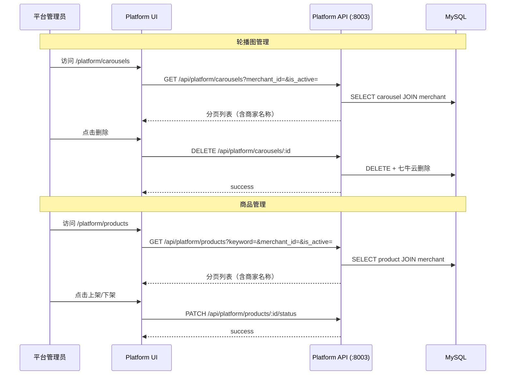

# 平台后台内容管理 — Spec

> 创建日期：2026-05-05
> 分支：`feature/qiniu-object-storage`
> 状态：已完成 ✅

---

## 1. 概述

为平台管理员（`/platform/*`）提供跨商家的轮播图和商品管理能力，使其能够查看、筛选、干预所有商家的内容数据。

### 与商家端的区别

| 维度 | 商家端 (`/admin/*`) | 平台端 (`/platform/*`) |
|------|---------------------|------------------------|
| 数据范围 | 仅当前商家的数据 | 所有商家的数据 |
| 操作权限 | 仅管理自己的轮播图/商品 | 可删除任意轮播图、可上架/下架任意商品 |
| 筛选能力 | 无需跨商家筛选 | 按商家 ID 筛选 |

### 活动图



---

## 2. API 契约

### 2.1 轮播图管理

| 方法 | 路径 | 认证 | 说明 |
|------|------|:----:|------|
| GET | `/api/platform/carousels` | JWT | 全平台轮播图列表（分页+筛选） |
| DELETE | `/api/platform/carousels/{id}` | JWT | 删除轮播图（含七牛云文件） |

#### GET /carousels 请求参数

| 参数 | 类型 | 必填 | 说明 |
|------|------|:----:|------|
| merchant_id | int | — | 按商家筛选 |
| is_active | bool | — | 按启用状态筛选 |
| page | int | — | 页码，默认 1 |
| page_size | int | — | 每页数量，默认 50，最大 200 |

#### GET /carousels 响应

```json
{
  "items": [
    {
      "id": 1,
      "merchant_id": 1,
      "shop_name": "柳州鲜选",
      "title": "新鲜虾类上市",
      "image_url": "https://cdn.example.com/carousels/2026-05/banner_abc123.jpg",
      "link_url": "/products?category=shrimp",
      "sort_order": 1,
      "is_active": true,
      "created_at": "2026-05-05T10:00:00",
      "updated_at": "2026-05-05T10:00:00"
    }
  ],
  "total": 5,
  "page": 1,
  "page_size": 50
}
```

#### DELETE /carousels/{id} 响应

```json
{"success": true}
```

错误码：
- `404` — 轮播图不存在
- `401` — 未认证或认证无效

### 2.2 商品管理

| 方法 | 路径 | 认证 | 说明 |
|------|------|:----:|------|
| GET | `/api/platform/products` | JWT | 全平台商品列表（分页+搜索+筛选） |
| PATCH | `/api/platform/products/{id}/status` | JWT | 上架/下架商品 |

#### GET /products 请求参数

| 参数 | 类型 | 必填 | 说明 |
|------|------|:----:|------|
| merchant_id | int | — | 按商家筛选 |
| is_active | bool | — | 按上架状态筛选 |
| keyword | str | — | 按名称模糊搜索 |
| page | int | — | 页码，默认 1 |
| page_size | int | — | 每页数量，默认 50，最大 200 |

#### GET /products 响应

```json
{
  "items": [
    {
      "id": 1,
      "merchant_id": 1,
      "shop_name": "柳州鲜选",
      "name": "鲜活基围虾",
      "description": "当日渔港直发...",
      "price": 68.00,
      "image": "https://cdn.example.com/products/2026-05/prod_abc.jpg",
      "category": "shrimp",
      "stock": 50,
      "sales": 120,
      "is_active": true,
      "created_at": "2026-05-01T08:00:00",
      "updated_at": "2026-05-05T10:00:00"
    }
  ],
  "total": 25,
  "page": 1,
  "page_size": 50
}
```

#### PATCH /products/{id}/status 请求

```json
{"is_active": false}
```

#### PATCH /products/{id}/status 响应

```json
{"success": true, "is_active": false}
```

---

## 3. 前端变更

### 3.1 新增页面

| 页面 | 路径 | 功能 |
|------|------|------|
| `PlatformCarousels.jsx` | `/platform/carousels` | 轮播图列表、按商家/状态筛选、删除 |
| `PlatformProducts.jsx` | `/platform/products` | 商品列表、搜索、按商家/状态筛选、上下架 |

### 3.2 导航变更

`PlatformLayout.jsx` 侧边栏新增：
- 轮播图 (`image` 图标)
- 商品管理 (`box` 图标)

### 3.3 路由变更

`App.jsx` 新增：
- `/platform/carousels` → PlatformRouteGuard + PlatformCarousels
- `/platform/products` → PlatformRouteGuard + PlatformProducts

---

## 4. 后端文件变更

| 文件 | 说明 |
|------|------|
| `services/platform/routes/carousels.py` | 新增：轮播图管理路由 |
| `services/platform/routes/products.py` | 新增：商品管理路由 |
| `services/platform/main.py` | 注册新路由 |
| `services/platform/Dockerfile` | 修复 CMD 指向 `services.platform.main:app` |

---

## 5. 验收标准

- [x] 平台管理员登录后可访问 `/platform/carousels` 页面
- [x] 轮播图列表支持按商家 ID 和启用状态筛选
- [x] 平台管理员可删除任意商家的轮播图
- [x] 平台管理员可查看 `/platform/products` 页面
- [x] 商品列表支持搜索、按商家、按状态筛选
- [x] 平台管理员可上架/下架任意商品
- [x] 后端 API 返回 401 给未认证用户
- [x] 前端页面 200 + 后端测试 33 passed

---

## 6. 数据模型

无新增模型。复用已有 `Carousel` 和 `Product` 模型，通过 JOIN `Merchant` 表获取商家名称。
