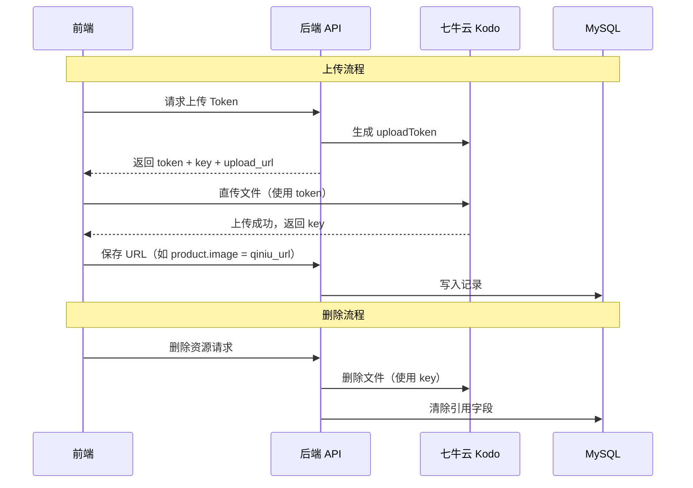

# 七牛云对象存储集成 — Spec

> 创建日期：2026-05-05
> 分支：`feature/qiniu-object-storage`
> 状态：实施中

---

## 1. 概述

使用七牛云 Kodo 对象存储替换当前的 URL 文本输入方式，为以下场景提供统一的图片上传能力：
- 商品图片（Product.image）
- 用户头像（User.avatar_url）
- 店铺 Logo（MerchantConfig.shop_logo）
- 轮播图/Banner（新建 Carousel 模型）

### 活动图



---

## 2. 数据模型变更

### 2.1 新增：Carousel（轮播图）

```python
class Carousel(SQLModel, table=True):
    id: Optional[int] = primary_key
    merchant_id: int = FK(merchant.id)
    title: str                    # 轮播图标题
    image_url: str                # 七牛云图片 URL
    link_url: str = ""            # 跳转链接（可选）
    sort_order: int = 0           # 排序
    is_active: bool = True        # 是否启用
    created_at: datetime
    updated_at: datetime
```

### 2.2 现有模型（无需改动，仅使用现有字段）
- `Product.image` — 存储七牛云 URL
- `User.avatar_url` — 存储七牛云 URL
- `MerchantConfig.shop_logo` — 存储七牛云 URL

---

## 3. API 契约

### 3.1 七牛云上传凭证（所有端共用）

| 方法 | 路径 | 认证 | 说明 |
|------|------|:----:|------|
| POST | `/api/upload/token` | JWT | 获取上传凭证 |

**请求体：**
```json
{
  "file_name": "product_001.jpg",
  "file_type": "image/jpeg",
  "folder": "products"
}
```

**响应体：**
```json
{
  "token": "七牛云 uploadToken",
  "key": "products/2026/05/05/uuid_product_001.jpg",
  "upload_url": "https://up-z2.qiniup.com",
  "file_url": "https://cdn.example.com/products/2026/05/05/uuid_product_001.jpg"
}
```

**folder 可选值：** `products` | `avatars` | `logos` | `carousels`

### 3.2 轮播图 CRUD（商家端）

| 方法 | 路径 | 认证 | 说明 |
|------|------|:----:|------|
| GET | `/api/merchant/carousels` | JWT | 获取轮播图列表 |
| POST | `/api/merchant/carousels` | JWT | 创建轮播图 |
| PUT | `/api/merchant/carousels/{id}` | JWT | 更新轮播图 |
| DELETE | `/api/merchant/carousels/{id}` | JWT | 删除轮播图 |
| PATCH | `/api/merchant/carousels/{id}/toggle` | JWT | 启用/禁用轮播图 |

### 3.3 轮播图公开接口（用户端）

| 方法 | 路径 | 认证 | 说明 |
|------|------|:----:|------|
| GET | `/api/customer/carousels` | — | 获取启用的轮播图列表 |

---

## 4. 环境变量

| 变量 | 用途 | 示例值 |
|------|------|--------|
| `QINIU_ACCESS_KEY` | 七牛云 AccessKey | `xxx` |
| `QINIU_SECRET_KEY` | 七牛云 SecretKey | `xxx` |
| `QINIU_BUCKET` | 七牛云 Bucket 名称 | `aquatic-market` |
| `QINIU_DOMAIN` | 七牛云 CDN 域名 | `https://cdn.example.com` |
| `QINIU_REGION` | 存储区域代码 | `z2`（华南）|

---

## 5. 前端变更计划

### 5.1 新增通用组件
- `ImageUploader.jsx` — 通用图片上传组件（拖拽/点击上传，显示进度，预览）

### 5.2 页面改造
| 页面 | 改造点 |
|------|--------|
| `AdminProducts.jsx` | 商品图片改为上传组件 |
| `AdminSettings.jsx` | 新增店铺 Logo 上传 |
| `My.jsx` | 新增用户头像上传 |
| `AdminCarousels.jsx`（新） | 轮播图管理页面 |
| `AdminLayout.jsx` | 导航栏新增"轮播图"入口 |
| `Home.jsx` | 首页接入轮播图展示 |

---

## 6. 实施批次

| 批次 | 内容 | 执行者 |
|:----:|------|--------|
| **B1** | 后端：七牛云 SDK 封装 + 上传 Token API + 轮播图模型/API | backend-engineer |
| **B2** | 后端：上传 API 挂载到三端服务 | backend-engineer |
| **B3** | 前端：ImageUploader 组件 + 商品/Logo/头像上传集成 | frontend-integration-engineer |
| **B4** | 前端：轮播图管理页面 + 首页接入 | frontend-integration-engineer |

---

## 7. 验收标准

- [ ] 商品创建时可上传图片到七牛云，而非填 URL 文本
- [ ] 用户可在"我的"页面点击头像上传新头像
- [ ] 商家可在设置页面上传店铺 Logo
- [ ] 商家可创建/编辑/删除轮播图（含排序）
- [ ] 首页展示启用的轮播图
- [ ] 后端测试全绿
- [ ] 前端 `npm run build` 无报错
- [ ] 前端构建产物无 localhost 硬编码

---

## 8. 待确认项

1. 七牛云 AK/SK/Bucket/Domain — 需用户提供
2. 轮播图是否需要跳转链接功能？
3. 单商家轮播图数量上限？
